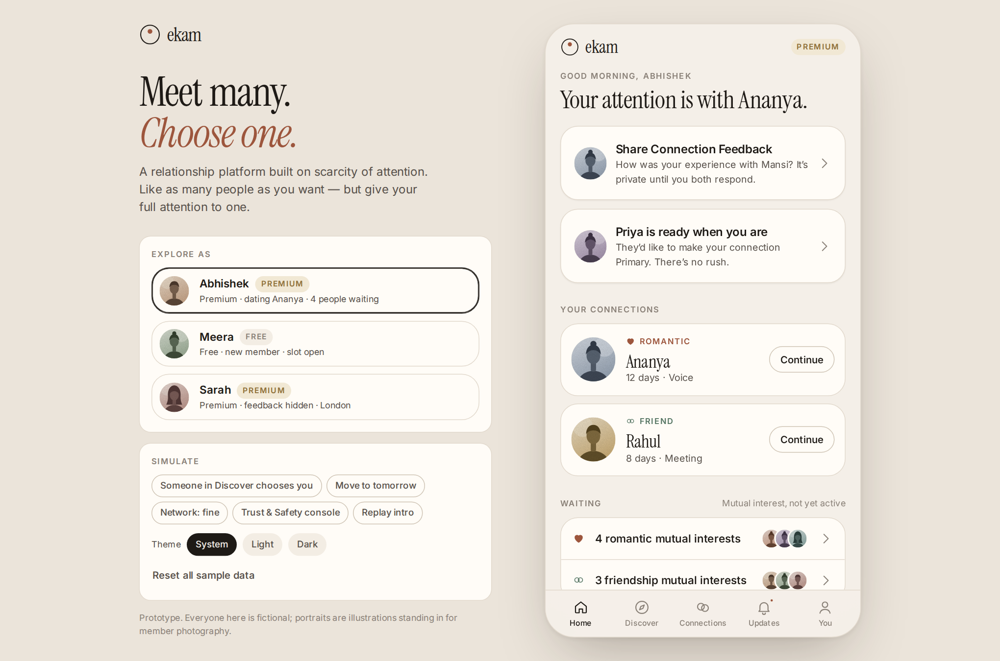
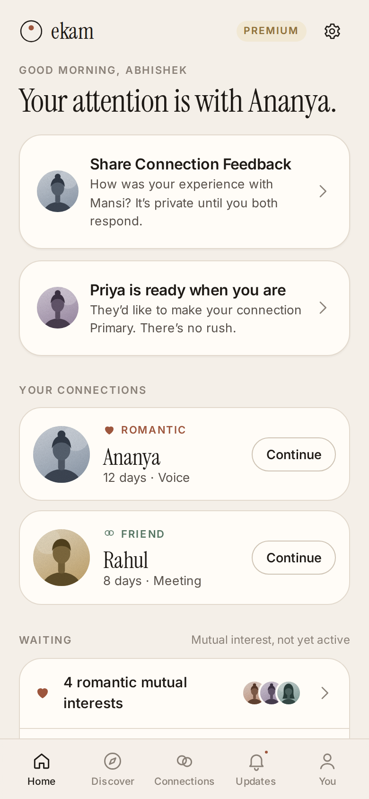
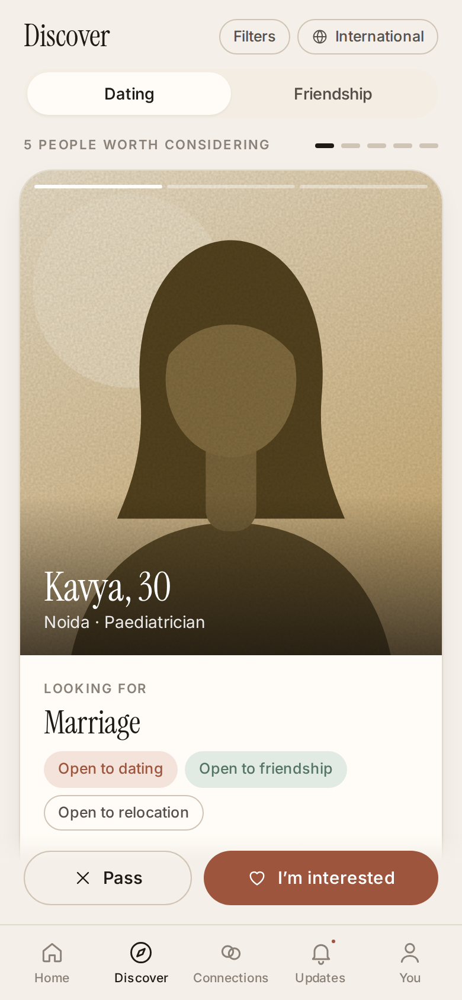
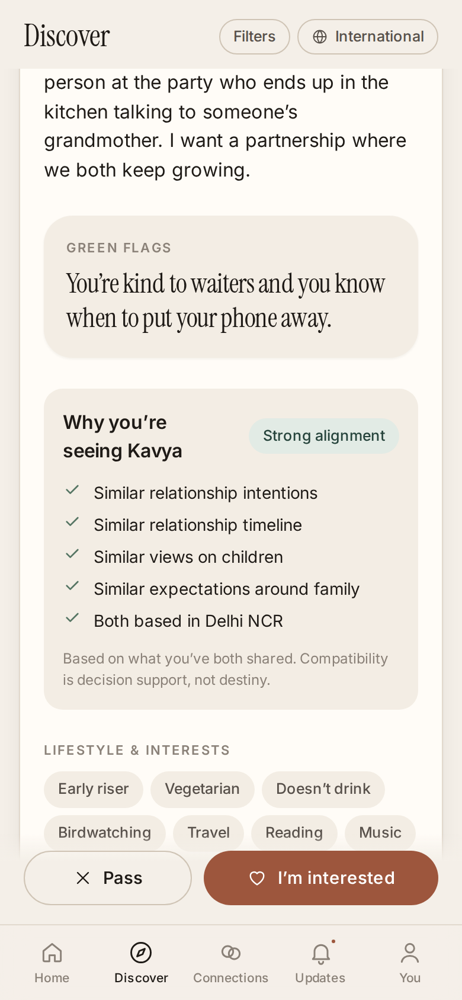
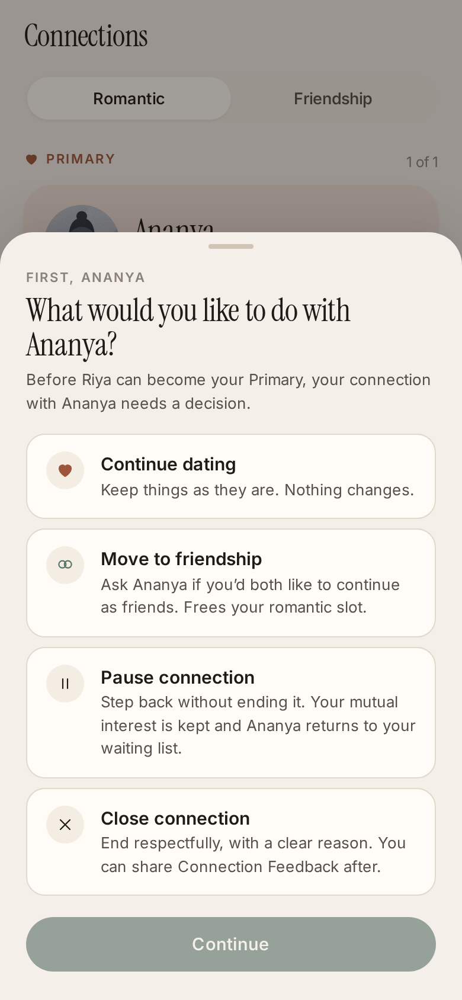
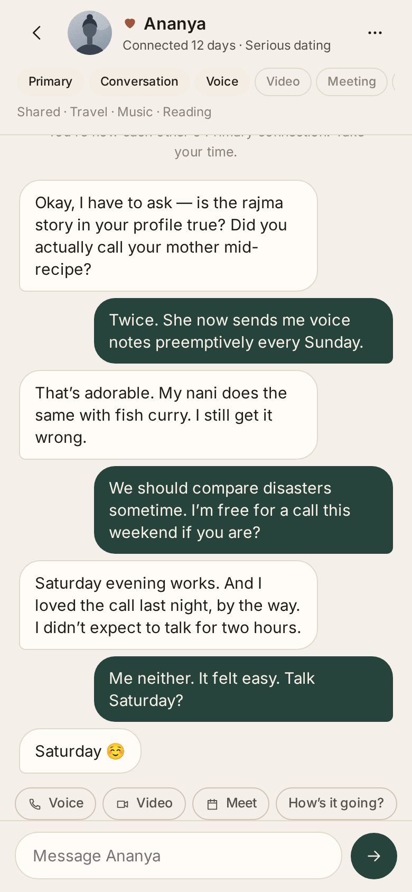
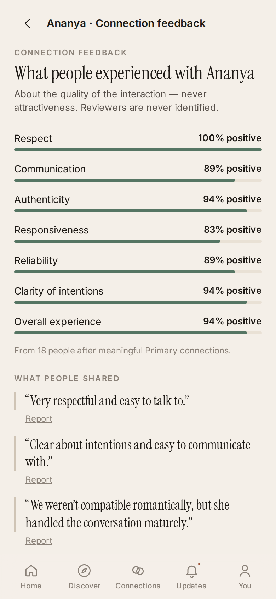
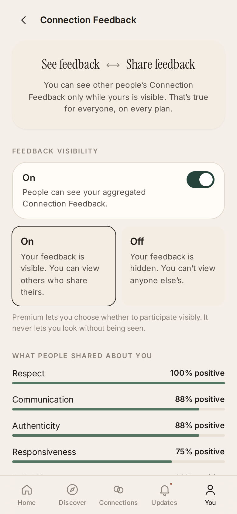
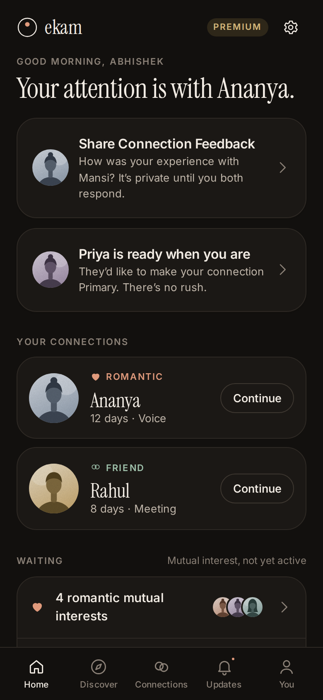

# ekam

**A dating and matrimonial app where you can like many people but date only one at a time.**

<!-- LIVE_DEMO -->

ekam (Sanskrit/Hindi for *one*) is a working front-end product prototype built with React and TypeScript. Most dating apps encourage endless swiping and dozens of parallel chats. ekam enforces scarcity of attention instead: each person has **one romantic Primary connection and one friendship Primary**. Everyone else with mutual interest waits on a waiting list until you make a deliberate, respectful decision about your current connection.



| Home | Discover | Why this person? | Change Primary |
| --- | --- | --- | --- |
|  |  |  |  |
| **Chat** | **Connection Feedback** | **Reciprocal visibility** | **Dark mode** |
|  |  |  |  |

## Features

- **One Primary per kind.** The rule is enforced in the domain layer: a Primary only starts when *both* people have a free slot, and a paused Primary keeps its slot reserved.
- **Mutual interest waits.** Expressing interest never opens a chat. Mutual interest goes to a waiting list, and you stay discoverable while dating.
- **Change Primary.** Before choosing someone new, you decide about the current connection: continue, move to friendship, pause and return to waiting, or close with a reason.
- **Curated discovery.** 5 recommendations a day, each explained with shared values and potential differences. The daily limit also holds when Premium filters change.
- **Connection Feedback.** Structured, anonymous feedback after a connection ends:
  - **Double-blind:** neither person sees the other's feedback until both have submitted, or 14 days pass.
  - **Minimum of 5:** percentages appear only once 5 responses exist.
  - **Moderated:** harmful comments are held for human review, and a Trust & Safety console handles reports.
- **Reciprocal privacy rule.** You can see other people's feedback only while your own is visible, so not even Premium members can look without being seen.
- **Free vs Premium.** Premium adds wider geographic reach, platform history, verification, incognito and advanced filters. It never adds more Primaries.
- **Complete UI states.** Loading skeletons, empty states, a retryable network error, light and dark themes, keyboard focus states and reduced-motion support.

The full product rules and design reasoning are in [docs/PRODUCT.md](docs/PRODUCT.md).

## Tech stack

| Area | Choice |
| --- | --- |
| UI | React 19, React Router 7 (hash routing for static hosting) |
| Language | TypeScript 5.9, strict mode |
| Build | Vite 8 |
| Styling | Hand-written CSS with design tokens; no UI framework |
| Unit tests | Vitest — 30 tests on the domain rules |
| End-to-end tests | Playwright — 12 user-flow tests on a mobile viewport |
| Quality | ESLint (typescript-eslint, React Hooks rules), zero-warning policy |
| CI | GitHub Actions: typecheck, lint, unit tests, build, end-to-end |

## Architecture

The product rules are pure TypeScript functions with no React imports. Each takes the current state and returns a new state, which keeps them easy to test and lets a real backend reuse them unchanged.

```
src/
  domain/             product rules (no React)
    rules.ts          connection engine: interest, Primary slots, pause, close, feedback
    discovery.ts      reach, eligibility, daily curation, compatibility reasons
    trust.ts          feedback access, aggregation thresholds, maturity, moderation screen
    privacy.ts        progressive sharing (Discovery → Mutual → Primary)
    entitlements.ts   what each plan unlocks
    types.ts          data model
    seed.ts           fictional sample community covering every state
    rules.test.ts     unit tests
  state/
    store.tsx         provider: simulated clock, localStorage persistence, toasts
    context.ts        useStore() hook
    simulate.ts       stands in for "the other person" so flows work on one device
  components/         Sheet, Portrait, Trust, ProfileBody, DemoPanel, shared UI
  screens/            Home, Discover, Connections, Chat, Feedback, Close, You, Premium, …
  lib/                formatting and theme helpers
e2e/                  Playwright specs
```

Two examples of rules kept out of the UI:

```ts
// src/domain/trust.ts: to see feedback, you must show yours
export function feedbackAccess(viewer: User, target: User): FeedbackAccess {
  if (viewer.id === target.id) return { allowed: true };
  if (!entitlements(viewer.plan).feedbackVisibilityControl) return { allowed: false, reason: 'free-plan' };
  if (!isFeedbackVisible(viewer)) return { allowed: false, reason: 'viewer-hidden' };
  if (!isFeedbackVisible(target)) return { allowed: false, reason: 'target-hidden' };
  return { allowed: true };
}
```

```ts
// src/domain/discovery.ts: changing filters can never show more than 5 people a day
const acted = existing.ids.filter((id) => hasInterest(s, viewerId, id, kind) || hasPassed(s, viewerId, id, kind));
const fresh = curate(s, viewerId, kind).slice(0, Math.max(0, DAILY_RECOMMENDATIONS - acted.length));
```

## Getting started

Requires Node.js 22.12 or later.

```bash
cd ekam
npm install
npm run dev        # http://localhost:5173
```

| Command | What it does |
| --- | --- |
| `npm run check` | Typecheck, lint, unit tests and production build |
| `npm test` | Unit tests (Vitest) |
| `npm run test:e2e` | End-to-end tests (Playwright; run `npx playwright install chromium` once first) |
| `npm run build` | Static production build in `dist/` |

## Trying the demo

The panel beside the phone frame (or the gear icon on mobile) lets you explore as three fictional members:

- **Abhishek** (Premium): dating Ananya, with four people waiting. Try changing your Primary, or moving Ananya to friendship.
- **Meera** (Free): a new member with an open slot. Start a Primary with Rohan and chat. Feedback shows as locked.
- **Sarah** (Premium, feedback hidden): she can't see anyone's feedback until she makes hers visible.

The same panel can also simulate the next day, a failing network, and someone choosing you. **Reset all sample data** starts over.

## Scope and limitations

This is a front-end prototype, so a few things are simulated:

- **No server.** Data lives in your browser's localStorage.
- **Simulated other side.** A small module plays "the other person", replying to chats and accepting friendship proposals so every flow can be tried alone.
- **No real checks or calls.** Verification, voice and video calls are UI flows only.
- **Illustrated portraits.** Every member is fictional, and the portraits are generated illustrations instead of photos.

Turning it into a production service would mean an API and database behind the existing domain functions, authentication, real-time messaging, and photo upload with moderation.

## License

[MIT](LICENSE)
