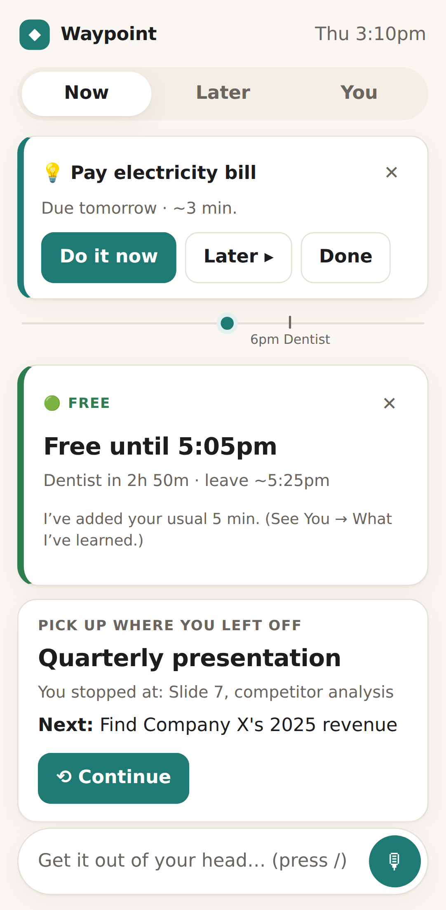
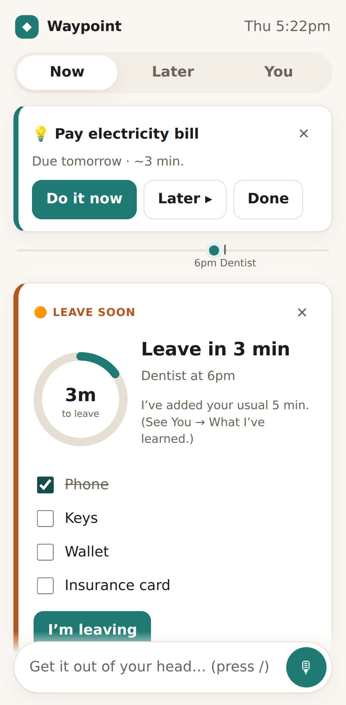
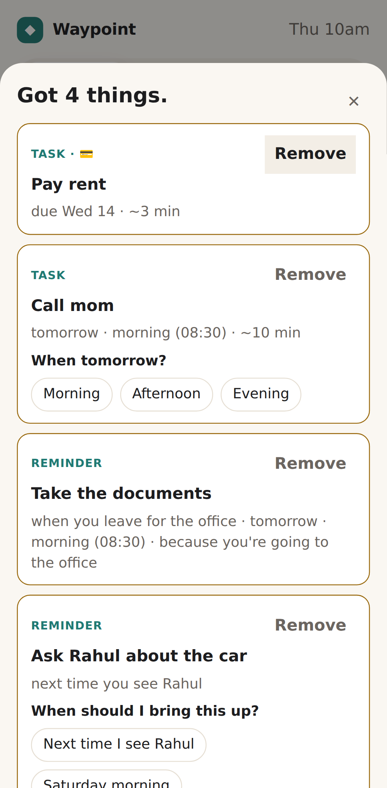
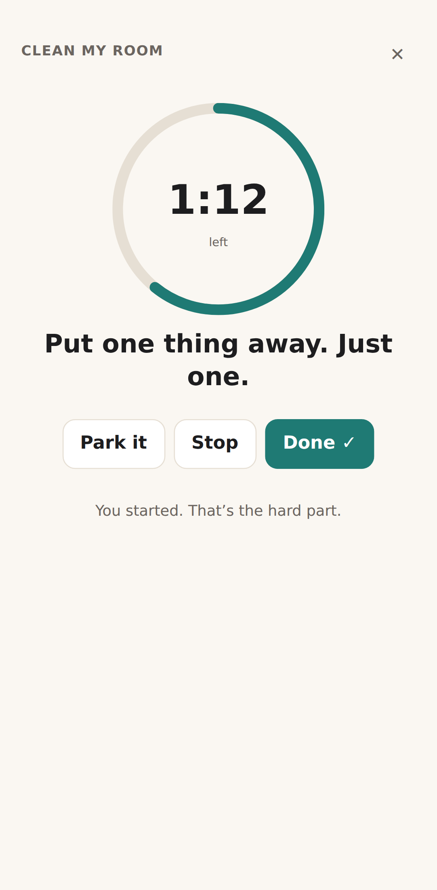

# Waypoint

**An ADHD-friendly assistant that cues you at the right moment, gets you started with one small step, and remembers where you stopped.**

Most to-do apps assume you'll remember to check them. Research on ADHD points the other way. Help works best *at the point of performance*: at the moment and place you need to act. Remembering at a set *time* is a specific weak spot, while remembering when something *happens* is much less affected ([Altgassen et al., 2014](https://doi.org/10.1177/1087054712445484)). Waypoint is built around that finding.

<p align="center">
  
  
  
  
</p>

## What it does

| | Feature | How it works |
|---|---|---|
| 🧠 | **Brain-dump capture** | Type or speak a messy list ("pay rent by the 14th, call mom tomorrow, ask Rahul about the car"). A rule-based natural-language parser splits it into items and extracts dates, times, deadlines, places, people, money and reasons. It asks **at most one** button question per item, and only when something is genuinely ambiguous. It never invents a date. |
| 🔔 | **Reminders that adapt instead of nagging** | A deterministic *reminder ladder*: cue → reframe → rescue. Each step changes strategy rather than repeating itself. Every reminder ends in a decision: **Do it · Make it smaller · Later ▸ · Drop**. A daily interruption budget, a per-item cap and quiet hours turn excess cues into a quiet digest. |
| 📍 | **Event-based reminders** | "When I get home…", "next time I see Rahul…", "when I leave for the office…" fire on context, not the clock. |
| 🚪 | **Leave-by countdown** | "Dentist at 6pm, 25 min drive" becomes *Free until 5:05 → Get ready → Leave in 8 min → Leave now*, with a checklist. It **learns your personal lateness** (median of recent departures, shrunk toward zero when there's little data) and tells you when it adjusts. |
| ▶️ | **Just start** | "How does it feel? Fine / Heavy / Can't even" → one physical first step sized to that feeling → a 2–25 minute timer. **Stopping counts as a win.** |
| ⟲ | **Where was I?** | Stopping saves your place (next action, where you were, a link). Resuming starts from that exact step. |
| 😮‍💨 | **Overwhelm mode & Reset my day** | Shrinks the world to one thing and pauses reminders for an hour. No counts, no guilt. |
| 🧹 | **Self-cleaning lists** | Undated items untouched for 14 days are tucked into *Someday*. After 5+ days away you get "Welcome back", not a guilt pile. |

## Engineering highlights

- **Pure, deterministic core** (`src/core/`): parser, cue engine, leave engine, recommender and micro-step library. Plain TypeScript with no DOM or React, so every rule is unit-testable. No AI model decides when to interrupt someone; auditable rules do.
- **79 unit tests** (Vitest), including golden-case tests for the parser taken from the product spec, ladder and budget behaviour, quiet hours across midnight, lateness learning, and a **tone test** that runs every reminder string through a "no shame" linter.
- **14 end-to-end tests** (Playwright) on mobile and desktop viewports, with a **pinned browser clock** so time-dependent behaviour is deterministic in CI. They include **axe-core accessibility scans** (WCAG 2.2 AA) of every main screen.
- **Local-first and private**: state lives in `localStorage` with export and delete-everything controls. No account, no backend, no analytics.
- **Accessible by design**: state is always shown as icon + words + colour, there are `prefers-reduced-motion` and dark-mode variants, targets are at least 44px, and live regions are used for timers and cues.
- **Installable PWA** with an offline service worker. About 90 KB of JS gzipped.
- **CI**: lint → typecheck → unit → e2e → deploy to GitHub Pages ([workflow](../.github/workflows/waypoint.yml)).

## Architecture

```
src/
├─ core/            Pure domain logic (fully unit-tested)
│  ├─ parser.ts       Brain dump → structured items (dates, triggers, people, money, ambiguity)
│  ├─ cues.ts         Reminder ladder, interruption budget, quiet hours, smart "later", context triggers
│  ├─ leave.ts        Leave/prep times, countdown states, personal lateness correction
│  ├─ recommend.ts    "What now?": one recommendation with a reason
│  ├─ microsteps.ts   Offline first-step library sized to how heavy a task feels
│  ├─ freshStart.ts   Self-cleaning lists and welcome-back
│  └─ copy.ts         Tone rules (banned shaming phrases)
├─ state/           External store (useSyncExternalStore) persisted to localStorage; demo data
└─ ui/              React components: Now, Later, You, Capture, StartFlow, Cues, Recover
e2e/                Playwright tests and screenshot generation
```

The cue engine is written so the same core could later drive native iOS/Android notifications (AlarmKit, Live Activities, geofences). The web app stands in for those with in-app cues, optional system notifications, and "I'm home / leaving" context buttons.

## Run it

```bash
npm install
npm run dev          # http://localhost:5173
npm test             # unit tests
npm run test:e2e     # end-to-end tests (run `npx playwright install chromium` once first)
npm run build        # production build in dist/
```

Click **"Show me a demo day"** on first launch to see the app with realistic data. Press <kbd>/</kbd> anywhere to capture.

## Research and design

The product is based on a research and design document covering ADHD executive function, time perception, prospective memory, notification research, competitor analysis, and the feature specs this app implements: [`docs/adhd-app/`](../docs/adhd-app/00-README.md).

## Limitations (honest ones)

- Browsers can't reliably wake a closed tab, so reminders fire while the app is open or in the background with notifications enabled. Reliable delivery when closed needs the native app described in the roadmap.
- Place triggers use "I'm home / leaving" buttons rather than geofencing.
- The parser is English-only and rule-based. Low-confidence input is flagged for a glance rather than sent to an AI model.

## Disclaimer

Waypoint is a planning and reminder tool. It does not diagnose or treat ADHD or any other condition, and it is not a substitute for professional care.

## License

MIT
